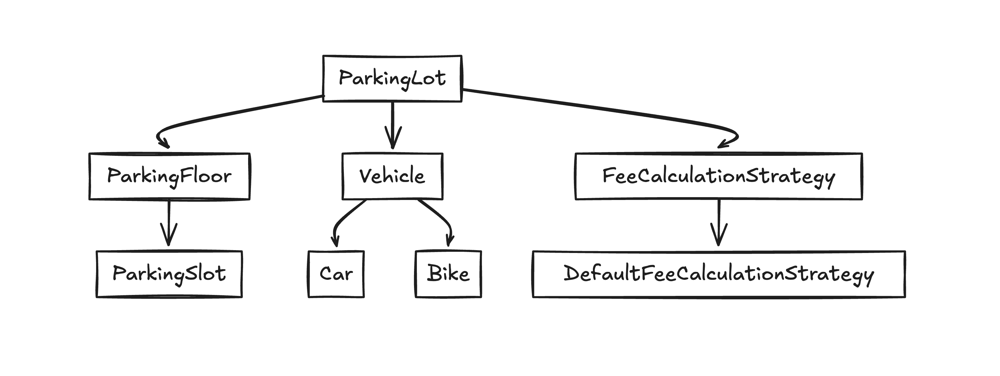
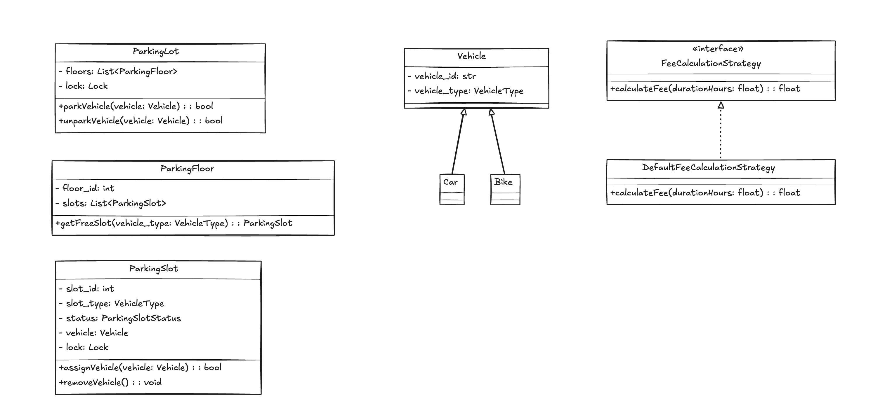

# Low-Level Design: Parking Lot System in Python

This comprehensive tutorial explains the complete thought process and architectural decision-making for designing a Parking Lot System in Python. We cover everything from requirements gathering, class identification, and design principles to code implementation, concurrency handling, and interview tips. The goal is to help you build a robust, maintainable, and extendable system.

---

## Table of Contents

1. [Introduction](#introduction)
2. [Requirements Gathering](#requirements-gathering)
3. [Architectural Decision-Making](#architectural-decision-making)
   - [Top-Down vs. Bottom-Up vs. Hybrid Approach](#top-down-vs-bottom-up-vs-hybrid-approach)
4. [Design Principles and Best Practices](#design-principles-and-best-practices)
   - [SOLID Principles](#solid-principles)
   - [Strategy Pattern](#strategy-pattern)
   - [Usage of Enums](#usage-of-enums)
   - [Concurrency Handling](#concurrency-handling)
5. [Identifying Classes and Their Responsibilities](#identifying-classes-and-their-responsibilities)
6. [Role of the Vehicle Class](#role-of-the-vehicle-class)
7. [Using Enums: Pros, Cons, and Open/Closed Principle](#using-enums-pros-cons-and-openclosed-principle)
8. [Collecting Requirements: Process and Considerations](#collecting-requirements-process-and-considerations)
9. [LLD Interview Key Points](#lld-interview-key-points)
10. [Additional Considerations](#additional-considerations)
11. [UML & Mermaid Diagrams](#uml--mermaid-diagrams)
12. [Python Code Implementation](#python-code-implementation)
13. [Conclusion and Key Takeaways](#conclusion-and-key-takeaways)

---

## 1. Introduction

Designing a scalable and maintainable parking lot system is not trivial. This tutorial takes you step-by-step through the entire process—from gathering requirements and identifying key classes to applying SOLID principles, handling concurrency, and implementing a flexible fee calculation strategy. This guide is crafted to prepare you for LLD interviews and real-world system design.

---

## 2. Requirements Gathering

### Functional Requirements
- **Vehicle Management:**  
  - Allow vehicles to enter (park) and exit (unpark).
  - Support multiple vehicle types (e.g., Car, Bike, Truck).
- **Slot Allocation:**  
  - Allocate appropriate parking slots based on the vehicle type.
- **Fee Calculation:**  
  - Compute parking fees based on duration and vehicle type.
- **Ticketing System:**  
  - Generate tickets to track parking duration and fees.

### Non-Functional Requirements
- **Scalability:**  
  - Design should support future extensions (more floors, more vehicle types).
- **Maintainability:**  
  - Code must be modular, follow SOLID principles, and be easy to modify.
- **Concurrency:**  
  - Handle multiple vehicles entering/exiting concurrently with thread-safe operations.
- **Extensibility:**  
  - Allow new features (e.g., dynamic pricing, reservations) to be added with minimal changes.

---

## 3. Architectural Decision-Making

### Top-Down vs. Bottom-Up vs. Hybrid Approach

#### Top-Down Approach
- **Process:** Define the overall system (e.g., ParkingLot, ParkingFloor) and then break it into smaller parts.
- **Pros:** Clear high-level structure; ensures overall requirements are addressed.
- **Cons:** Low-level issues might be discovered later.

#### Bottom-Up Approach
- **Process:** Start by designing individual components (e.g., ParkingSlot, Vehicle) and integrate them.
- **Pros:** Early focus on detailed implementation; easier unit testing.
- **Cons:** Risk of missing the overall system structure.

#### Hybrid Approach (Recommended)
- **Process:**
  1. **Top-Down:** Define the major components.
  2. **Bottom-Up:** Implement and refine each component with detailed design.
- **Why Hybrid?**  
  Balances overall vision with robust, detailed components, ensuring extensibility and maintainability.

---

## 4. Design Principles and Best Practices

### SOLID Principles
- **Single Responsibility (SRP):**  
  Each class should only have one responsibility.  
- **Open/Closed (OCP):**  
  Classes should be extendable without modifying their source code.
- **Liskov Substitution (LSP):**  
  Subclasses should be replaceable with their parent classes.
- **Interface Segregation (ISP):**  
  Favor multiple, specific interfaces over a single, general-purpose one.
- **Dependency Inversion (DIP):**  
  Depend on abstractions rather than concrete implementations.

### Strategy Pattern
- **Usage:**  
  Implement fee calculation using a strategy pattern to allow easy swapping of pricing algorithms.

### Usage of Enums
- **Purpose:**  
  Provide clarity and type safety for fixed values like vehicle types and slot statuses.
- **Considerations:**  
  Although enums can lead to some coupling, they enhance readability and reduce errors when used with a stable domain.

### Concurrency Handling
- **Challenge:**  
  Multiple threads may access shared resources (e.g., parking slots) concurrently.
- **Solution:**  
  Use Python's `threading.Lock` for both fine-grained (slot-level) and coarse-grained (global) locking.

---

## 5. Identifying Classes and Their Responsibilities

### Thought Process:
1. **Analyze Requirements:**  
   Identify the primary entities (nouns) and actions (verbs):
   - Entities: ParkingLot, ParkingFloor, ParkingSlot, Vehicle, FeeCalculator, Ticket.
   - Actions: Park, Unpark, Allocate Slot, Calculate Fee.
2. **Map to Real-World Objects:**  
   Consider the real-world analogy:
   - Who manages the parking lot? (→ `ParkingLot`)
   - What represents an individual parking space? (→ `ParkingSlot`)
   - How do we manage vehicle information? (→ `Vehicle`)
3. **Single Responsibility:**  
   Ensure each class has one responsibility. For example, `ParkingSlot` should only manage slot occupancy, not fee calculation.
4. **Define Relationships:**  
   - A `ParkingLot` contains multiple `ParkingFloor` objects.
   - Each `ParkingFloor` contains multiple `ParkingSlot` objects.
   - A `ParkingSlot` is associated with a `Vehicle` when occupied.
5. **Extensibility:**  
   Design classes so that new features (like additional vehicle attributes or pricing strategies) can be added without major refactoring.

---

## 6. Role of the Vehicle Class

### Why Include a Vehicle Class?
- **Abstraction & Future-Proofing:**  
  Even if today you only care about the vehicle type, the `Vehicle` class can later include:
  - License plate number
  - Owner details
  - Vehicle dimensions
- **Polymorphism:**  
  Allows you to subclass into `Car`, `Bike`, etc., to override or extend behavior if requirements change.
- **Encapsulation:**  
  A dedicated `Vehicle` class encapsulates vehicle-related attributes, making the code cleaner and easier to manage.

### Counterpoint:
- **Minimalistic Approach:**  
  If the only requirement is the vehicle type, one might consider using a simple type flag. However, this limits future flexibility and clarity.

---

## 7. Using Enums: Pros, Cons, and Open/Closed Principle

### Pros:
- **Clarity:**  
  Enums make the code more readable (e.g., `VehicleType.CAR` vs. `"Car"`).
- **Type Safety:**  
  They prevent invalid values and typos.
- **Centralized Domain Values:**  
  They provide a single source of truth for fixed domain values.

### Cons:
- **Coupling:**  
  Adding new values might require changes in multiple parts of the code.
- **Potential Violation of OCP:**  
  If enums are overused or changed frequently, they might introduce coupling.

### Mitigation:
- **Use Enums for Stable Values:**  
  Apply enums only to domain aspects that are unlikely to change (like vehicle types in a parking lot).
- **Design Extension Points:**  
  Combine enums with mapping functions or strategies to reduce coupling when adding new behavior.

---

## 8. Collecting Requirements: Process and Considerations

### Steps:
1. **Clarification:**  
   Ask questions to understand the problem's scope:
   - "What vehicle types should we support?"
   - "How many floors are there?"
   - "Is dynamic fee calculation needed?"
2. **Core vs. Optional:**  
   Identify core functionalities (e.g., parking/unparking, fee calculation) versus optional features (e.g., reservations).
3. **Prioritize Simplicity:**  
   Start with the simplest version of the system and iterate. Document assumptions, e.g., "For this exercise, we assume only two vehicle types."
4. **Document Assumptions:**  
   Clearly state any assumptions to show thoughtful consideration.

### Interview Tips:
- **Structured Approach:**  
  Break down requirements methodically.
- **Communication:**  
  Clearly explain what is in scope and what is not.
- **Focus on Essentials:**  
  Address core functionalities first and then mention possible extensions.

---

## 9. LLD Interview Key Points

- **Clear Communication:**  
  Explain your thought process and design choices using diagrams and pseudocode.
- **SOLID Principles:**  
  Emphasize that each class has a single responsibility and that your design is easily extendable.
- **Trade-offs:**  
  Discuss the pros and cons of your choices (e.g., using enums).
- **Concurrency:**  
  Always address potential concurrency issues and your solution.
- **Diagrams:**  
  Use UML or Mermaid diagrams to visualize the design.

---

## 10. Additional Considerations

- **Error Handling & Edge Cases:**  
  Plan for scenarios where no parking slots are available or an invalid vehicle type is encountered.
- **Testing & Documentation:**  
  Ensure the design is testable, and document every component.
- **Logging & Monitoring:**  
  Consider integrating logging for key operations (e.g., parking, unparking).
- **Future Enhancements:**  
  Design with future requirements in mind (e.g., reservation systems, dynamic pricing).

---

## 11. UML Diagrams

### Component Diagram


### Class Diagram


---


## 12. Python Code Implementation

```
from enum import Enum
import threading
import time

# -------------------------------
# Enums for Vehicle Types and Parking Slot Status
# -------------------------------
class VehicleType(Enum):
    CAR = "Car"
    BIKE = "Bike"
    # Additional types (e.g., TRUCK) can be added here

class ParkingSlotStatus(Enum):
    FREE = "Free"
    OCCUPIED = "Occupied"

# -------------------------------
# ParkingSlot: Represents a single parking space with thread safety
# -------------------------------
class ParkingSlot:
    def __init__(self, slot_id, slot_type: VehicleType):
        self.slot_id = slot_id
        self.slot_type = slot_type
        self.status = ParkingSlotStatus.FREE
        self.vehicle = None
        self.lock = threading.Lock()  # Fine-grained locking for each slot

    def assign_vehicle(self, vehicle):
        with self.lock:
            if self.status == ParkingSlotStatus.FREE:
                self.vehicle = vehicle
                self.status = ParkingSlotStatus.OCCUPIED
                return True
            return False

    def remove_vehicle(self):
        with self.lock:
            if self.status == ParkingSlotStatus.OCCUPIED:
                self.vehicle = None
                self.status = ParkingSlotStatus.FREE

# -------------------------------
# ParkingFloor: Contains multiple ParkingSlot objects
# -------------------------------
class ParkingFloor:
    def __init__(self, floor_id, slots):
        self.floor_id = floor_id
        self.slots = slots  # List of ParkingSlot instances

    def get_free_slot(self, vehicle_type: VehicleType):
        for slot in self.slots:
            if slot.status == ParkingSlotStatus.FREE and slot.slot_type == vehicle_type:
                return slot
        return None

# -------------------------------
# ParkingLot: Manages overall parking operations across multiple floors
# -------------------------------
class ParkingLot:
    def __init__(self, floors):
        self.floors = floors  # List of ParkingFloor instances
        self.lock = threading.Lock()  # Global lock for thread safety

    def park_vehicle(self, vehicle):
        with self.lock:
            for floor in self.floors:
                slot = floor.get_free_slot(vehicle.vehicle_type)
                if slot and slot.assign_vehicle(vehicle):
                    print(f"Vehicle {vehicle.vehicle_id} parked in slot {slot.slot_id} on floor {floor.floor_id}")
                    return True
        print(f"No available slot for vehicle {vehicle.vehicle_id}")
        return False

    def unpark_vehicle(self, vehicle):
        with self.lock:
            for floor in self.floors:
                for slot in floor.slots:
                    if slot.vehicle == vehicle:
                        slot.remove_vehicle()
                        print(f"Vehicle {vehicle.vehicle_id} removed from slot {slot.slot_id} on floor {floor.floor_id}")
                        return True
        return False

# -------------------------------
# Vehicle Class and its Subclasses
# -------------------------------
class Vehicle:
    def __init__(self, vehicle_id, vehicle_type: VehicleType):
        self.vehicle_id = vehicle_id
        self.vehicle_type = vehicle_type

class Car(Vehicle):
    def __init__(self, vehicle_id):
        super().__init__(vehicle_id, VehicleType.CAR)

class Bike(Vehicle):
    def __init__(self, vehicle_id):
        super().__init__(vehicle_id, VehicleType.BIKE)

# -------------------------------
# Fee Calculation Strategy: Using the Strategy Pattern
# -------------------------------
class FeeCalculationStrategy:
    def calculate_fee(self, parking_duration_hours):
        raise NotImplementedError("Please implement the calculate_fee method.")

class DefaultFeeCalculationStrategy(FeeCalculationStrategy):
    def calculate_fee(self, parking_duration_hours):
        # Example: First hour free, $10 per additional hour.
        if parking_duration_hours <= 1:
            return 0
        return (parking_duration_hours - 1) * 10

# -------------------------------
# Example Usage
# -------------------------------
if __name__ == "__main__":
    # Create parking slots for a floor
    slots_floor1 = [
        ParkingSlot(slot_id=1, slot_type=VehicleType.CAR),
        ParkingSlot(slot_id=2, slot_type=VehicleType.BIKE)
    ]
    floor1 = ParkingFloor(floor_id=1, slots=slots_floor1)
    
    # Initialize ParkingLot with one floor (extendable to more floors)
    parking_lot = ParkingLot(floors=[floor1])
    
    # Create vehicle instances
    car1 = Car("CAR123")
    bike1 = Bike("BIKE123")
    
    # Park vehicles
    parking_lot.park_vehicle(car1)
    parking_lot.park_vehicle(bike1)
    
    # Simulate parking duration (e.g., 2 hours)
    time.sleep(2)
    
    # Calculate fees using the strategy pattern
    fee_strategy = DefaultFeeCalculationStrategy()
    duration_hours = 2  # Example duration
    fee = fee_strategy.calculate_fee(duration_hours)
    print(f"Parking fee for {duration_hours} hours: ${fee}")
    
    # Unpark vehicles
    parking_lot.unpark_vehicle(car1)
    parking_lot.unpark_vehicle(bike1)

```